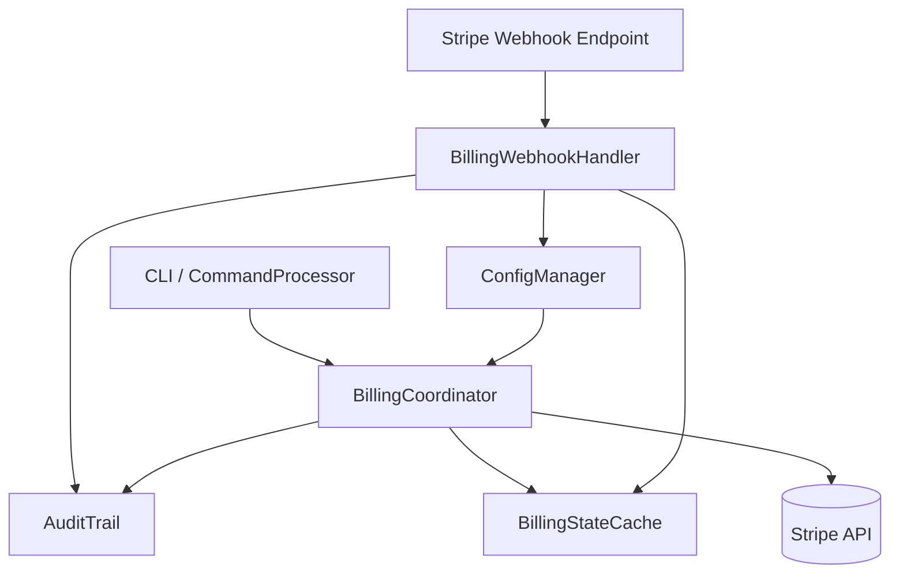

# MurtiWiFi Connecter Stripe Subscription Architecture

## 概要 / Overview
- **日本語**: 本設計書は MurtiWiFi Connecter に Stripe サブスクリプション課金機能を統合するためのアーキテクチャ、構成要素、運用フローを整理します。
- **English**: This document outlines the architecture, components, and operational flows required to integrate Stripe subscription billing with MurtiWiFi Connecter.

## 目的 / Objectives
- **日本語**:
  - エディション別の月額課金 (Professional / Enterprise) を Stripe Subscription で提供
  - 課金状態による機能制御 (エディション判定、Grace Period、アラート)
  - Webhook ベースのイベント連携と監査ログ反映
  - 環境変数・安全な設定管理による Stripe API キー保護
- **English**:
  - Offer subscription-based pricing (Professional / Enterprise tiers) via Stripe Subscriptions
  - Enforce feature gating based on billing state (edition, grace period, alerts)
  - Process Stripe webhook events and synchronize with audit trails
  - Protect API keys through environment variables and secure configuration management

## 全体構成 / High-Level Architecture


## コンポーネント概要 / Component Overview
- **BillingCoordinator (`Core/Billing/BillingCoordinator.cs`)**
  - Stripe API クライアントとの連携（購読状態の取得・更新）
  - キャッシュと ConfigManager を利用した状態管理
  - CommandProcessor / AutomationEngine からの課金状態照会 API を提供
- **StripeGateway (`Core/Billing/StripeGateway.cs`)**
  - Stripe .NET SDK を薄いラッパーで管理
  - Subscription, Customer, Product 情報の CRUD
  - API キーは環境変数 `STRIPE_API_KEY` から読み込み、`SecurityManager` で保護
- **BillingStateCache (`Core/Billing/BillingStateCache.cs`)**
  - メモリキャッシュ + ディスク永続化 (HMAC 付き) による課金状態の高速照会
  - Grace Period, Pending Cancellation, Past Due などを判定
- **BillingPolicyEnforcer (`Core/Billing/BillingPolicyEnforcer.cs`)**
  - コマンド実行前の機能制限ロジック
  - `CommandExecution.RunAsync()` にフックし、エディション毎の許可コマンドを定義
- **StripeWebhookHandler (`Core/Billing/StripeWebhookHandler.cs`)**
  - `publish/StripeWebhook.exe` (self-hosted HTTP listener) または ASP.NET Minimal API による常駐
  - `config.json` に定義された `Billing.WebhookSecret` を用いて署名検証
  - イベントを `AuditTrail`・`Logger` に記録し、`BillingStateCache` を更新

## データフロー / Data Flows
### 1. CLI 起動時チェック / Startup Billing Check
1. `Program.Main` で `BillingCoordinator.InitializeAsync()` を呼び出しキャッシュを同期。
2. API キーが未設定/無効な場合、警告を出力し、機能を「Freeエディション」扱いで継続。
3. 最新購読状態を Stripe から取得し、`BillingStateCache` に反映。
4. Audit に "BillingStateRefreshed" イベントを記録。

### 2. コマンド実行前の検証 / Command Enforcement
1. `CommandExecution.RunAsync` 内のプリフライトで `BillingPolicyEnforcer.VerifyAccessAsync(command)` を呼び出し。
2. 実行権限がない場合はエラーメッセージと CLI ガイダンスを表示。
3. 許可された場合は通常処理、`BillingStateCache.LastVerification` を更新。

### 3. Webhook イベント処理 / Webhook Handling
1. Stripe からのイベント (`invoice.payment_succeeded`, `customer.subscription.deleted` 等) を受信。
2. `StripeWebhookHandler` が署名検証 (`Stripe-Signature` ヘッダ + `WebhookSecret`).
3. 課金状態を更新し、変更差分を `BillingStateCache` に保存。
4. `AuditTrail.RecordEventAsync("Billing", ... )` で履歴を残す。
5. CLI 利用中の場合は `BillingCoordinator.NotifyStateChange()` で対話プロンプトに警告表示。

### 4. 管理者操作 / Admin Commands
- `billing status` コマンドで現在の購読状態、エディション、請求サマリを表示。
- `billing refresh` で Stripe API から強制同期。
- `billing set-edition --override` は緊急時の手動上書き (Audit + 期間限定)。

## Stripe リソース設計 / Stripe Resource Design
- **Products & Prices**
  - `murti-pro-monthly` (Professional, 月額)
  - `murti-enterprise-monthly` (Enterprise, 月額)
- **Customers**
  - MurtiWiFi Connecter インスタンスを識別する `installationId` をメタデータに付与。
- **Subscriptions**
  - Tiers 切替はプラン変更で対応。キャンセルは即時 or period_end。
- **Webhook Events**
  - `customer.subscription.created`
  - `customer.subscription.updated`
  - `customer.subscription.deleted`
  - `invoice.payment_succeeded`
  - `invoice.payment_failed`
  - `customer.subscription.trial_will_end`

## 設定 / Configuration
```jsonc
{
  "Billing": {
    "Enabled": true,
    "DefaultEdition": "Free",
    "Stripe": {
      "ProductProfessional": "prod_XXXXXXXX",
      "ProductEnterprise": "prod_YYYYYYYY",
      "PriceProfessionalMonthly": "price_pro_monthly",
      "PriceEnterpriseMonthly": "price_ent_monthly"
    },
    "Webhook": {
      "EndpointSecret": "{{STRIPE_WEBHOOK_SECRET}}",
      "ListenAddress": "http://127.0.0.1:8787/stripe-webhook"
    },
    "GracePeriodDays": 7,
    "CacheTtlSeconds": 60,
    "OfflineToleranceHours": 12
  }
}
```
- API Secret Key: OS environment variable `STRIPE_API_KEY`
- Webhook Secret: environment variable `STRIPE_WEBHOOK_SECRET`
- エディション上書き: `Billing.OverrideEdition` (HMAC 付きファイルで短期保存)

## CLI コマンド設計 / CLI Commands
| Command | Description (EN) | 説明 (JP) |
|---------|------------------|-----------|
| `billing status` | Show current subscription tier, renewal date, grace period | 現在のサブスクリプション階層・更新日・猶予期間を表示 |
| `billing refresh` | Force refresh from Stripe API | Stripe API から強制同期 |
| `billing sync-cache` | Rebuild billing cache from persisted state | 永続化情報からキャッシュを再構築 |
| `billing set-edition <tier> --override` | Temporarily override edition (with audit) | 一時的にエディションを上書き (監査記録付き) |
| `billing diagnostics` | Emit JSON diagnostics for support | サポート向け診断情報 JSON を出力 |

## 機能制御マトリクス / Feature Gating Matrix
| Feature Group | Free | Professional | Enterprise |
|---------------|------|--------------|------------|
| 基本接続コマンド / Core Connectivity | ✅ | ✅ | ✅ |
| 自動化エンジン / AutomationEngine | ⛔ | ✅ | ✅ |
| 監査レポート / AuditTrail Export | ⛔ | ✅ | ✅ |
| リアルタイム監視 / Realtime Monitor | ⛔ | ⛔ | ✅ |
| 高度分析 / Advanced Analytics | ⛔ | ⛔ | ✅ |

## 監査・ログ / Audit & Logging
- `AuditTrail.RecordEventAsync("Billing", "StateChanged", {...})`
- `Logger.LogInfo("Billing state refreshed", ...)`
- Webhook 受信毎に署名検証結果と処理結果を記録
- CLI コマンド実行時に `command`, `edition`, `result`, `billingState` を付与

## テスト戦略 / Test Strategy
- **Unit Tests**: StripeGateway の API 呼び出しを `IStripeClient` モックで検証
- **Integration Tests**: Webhook エンドポイントに Stripe CLI からイベント送信し、状態反映を確認
- **Failover Tests**: API キー欠如、ネットワーク遮断、過去データのみでの Grace 継続を確認
- **Regression Tests**: `CommandExecution` 経路で機能制限が正しく作動するか検証

## 導入ロードマップ / Implementation Roadmap
1. コアモジュール追加 (`Core/Billing/*`, DI 構成)
2. ConfigManager 拡張 (`Billing` セクション, 検証/正規化)
3. CommandProcessor 強化 (`billing` コマンド群, 機能制限フック)
4. Stripe SDK 追加 (`Stripe.net` NuGet), API キー管理
5. Webhook リスナー実装 (Windows サービス or 自己ホスト HTTP)
6. テスト・ドキュメント整備 (ユーザー向け課金ガイド, 運用 Runbook)

## リスクと対策 / Risks & Mitigations
- **API Key 漏洩**: 環境変数と `SecurityManager` ACL で保護、CLI から表示禁止
- **Webhook 失敗**: 再送ロジック、署名検証リトライ、ローカルキャッシュの GracePeriod 運用
- **Stripe 障害時の継続性**: OfflineTolerance を用い、一時的に最終成功状態を継続
- **ユーザー混乱**: CLI とドキュメントでエディション別機能差を明確化

## 今後の拡張 / Future Enhancements
- Usage-based Add-ons (従量課金) の検討
- エンタープライズ向け請求書請求 (Stripe Invoicing) 連携
- Azure AD / Okta との SSO 統合によるライセンス連携

---
最終更新日 / Last Updated: 2025-10-08
